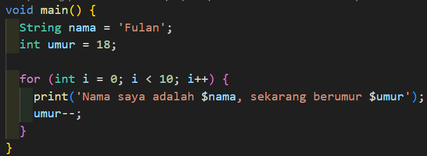
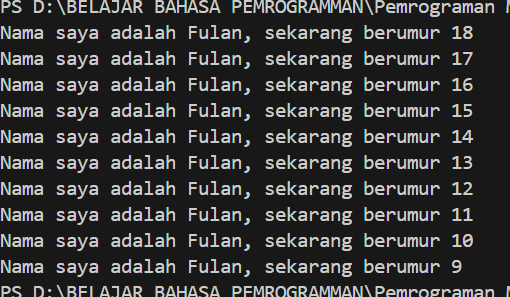

# **Pertemuan 2**

## **Tugas Praktikum** 
 

## Jawaban:
### **Soal 1**

### **Soal 2**
Karena Flutter sepenuhnya dibangun menggunakan Dart. Dengan pemahaman yang kuat tentang Dart, kita dapat menulis kode yang efisien, memahami konsep seperti asynchronous programming, dan memanfaatkan fitur-fitur Dart yang mendukung pengembangan aplikasi mobile yang responsif dan cepat. 

### **Soal 3** 
    1. Getting Started with Dart:
        - Dart adalah bahasa pemrograman modern yang dikembangkan oleh Google, dirancang untuk produktivitas tinggi dan performa        optimal, terutama dalam pengembangan aplikasi Flutter.
        - Dart dapat digunakan di berbagai platform (web, server, mobile).
    2. The Evolution of Dart:
        - Sejak dalam rilis Dart 2.0 menjelang akhir 2018, Dart adalah bahasa modern yang luar biasa, mendukung lintas platform, dan memiliki tujuan umum dengan terus meningkatkan fitur-fiturnya, membuatnya lebih kekinian dan fleksibel. Itulah sebabnya tim Flutter framework memilih bahasa Dart untuk digunakan.
    3. How Dart Works:
        - Dart mendukung JIT (Just-In-Time) saat pengembangan untuk proses yang lebih cepat, dan AOT (Ahead-of-Time) saat deployment untuk performa optimal.
        - Dart memiliki garbage collector yang efisien untuk mengelola memori secara otomatis.
    4. Introducing the Structure of the Dart Language:
        - Dart memiliki struktur yang mudah dipahami, mirip dengan bahasa pemrograman lain seperti bahasa C atau Javascript.
        - Seperti kebanyakan bahasa modern, Dart dirancang untuk object-oriented Programming (OOP).
        - Dart juga memiliki Arithmetic operators, Increment and decrement operators, Equality and relational operators, dan Logical operators.
    5. Hands-on with Dart:
        - Desain Flutter sangat dipengaruhi oleh bahasa Dart, jadi kita mempelajari bahasa Dart itu sangat penting untuk keberhasilan dalam menggunakan framework Flutter. 
        - Langsung praktik menggunakan DartPad menulis kode Dart dengan fitur-fitur penting seperti variables, functions, classes, dan for loop.