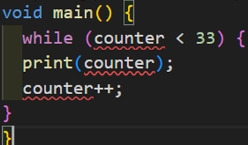

# Pertemuan 3

### **Praktikum 1: Menerapkan Control Flows("ifelse")**

##### **Langkah 1 dan 2**
  
**Pejelasan:** Akan terjadi error, karena sebelumnya tidak ada void main(), lalu Huruf pertama 
setelah else harus kecil, yaitu else if bukan Else maupun If. 

##### **Langkah 3**
**Penjelasan:** Kode yang diberikan akan terjadi error, karena di if tidak ada kondisi 
perbandinagannya. Berikut kode yang sudah diperbaiki: 

### **Praktikum 2: Menerapkan Perulangan "while" dan "do-while"**

##### **Langkah 1 dan 2**
  
**Penjelasan:** Akan terjadi error, karena variabel counter belum dideklarasikan sebelum 
digunakan. Berikut kode yang benar:

##### **Langkah 3**
  
**penjelasan:** tidak terjadi error, karena penulisan kode berjalan sesuai dengan semestinya. 

### **Praktikum 3: Menerapkan Perulangan "for" dan "break-continue"**

##### **Langkah 1 dan 2**
  
**Penjelasan:** Terjadi error, Karena variabel indeks tidak konsisten menggunakan huruf 
besar/kecil, variabel indeks belum dideklarasi, dan tidak ada nya increment untuk menambah 
nilai. Berikut kode yang sudah diperbaiki: 

##### **Langkah 3**
  
**Penjelasan:** Akan terjadi error. Berikut kode yang sudah diperbaiki:
 
Kode ini tidak ada output, karena perintah continue akan membuat program melewati seluruh 
iterasi sebelum sempat mencapai print(index). 

## **Tugas Praktikum**
Buatlah sebuah program yang dapat menampilkan bilangan prima dari angka 0 sampai 201 
menggunakan Dart. Ketika bilangan prima ditemukan, maka tampilkan nama lengkap dan NIM 
Anda.
 
 

