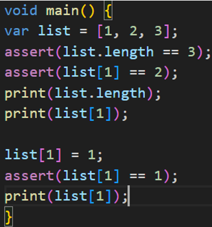
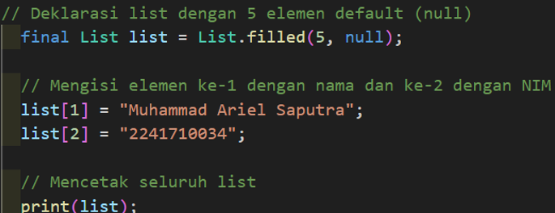

# Pertemuan 4

### **Praktikum 1: Eksperimen Tipe Data List**

##### **Langkah 1 dan 2**
  
**Pejelasan:** Program ini berjalan normal dan tidak ada kesalahan karena semua assertions berhasil. Assertions digunakan untuk memastikan bahwa kondisi yang diuji benar selama runtime (saat debugging).

##### **Langkah 3**
  
**Pejelasan:** Akan muncul output [null, Muhammad Ariel Saputra, 2241710034, null, null].

### **Praktikum 2: Eksperimen Tipe Data Set**

##### **Langkah 1 dan 2**
  
**Pejelasan:** Program ini berjalan normal dan tidak ada kesalahan karena semua assertions berhasil. Assertions digunakan untuk memastikan bahwa kondisi yang diuji benar selama runtime (saat debugging).